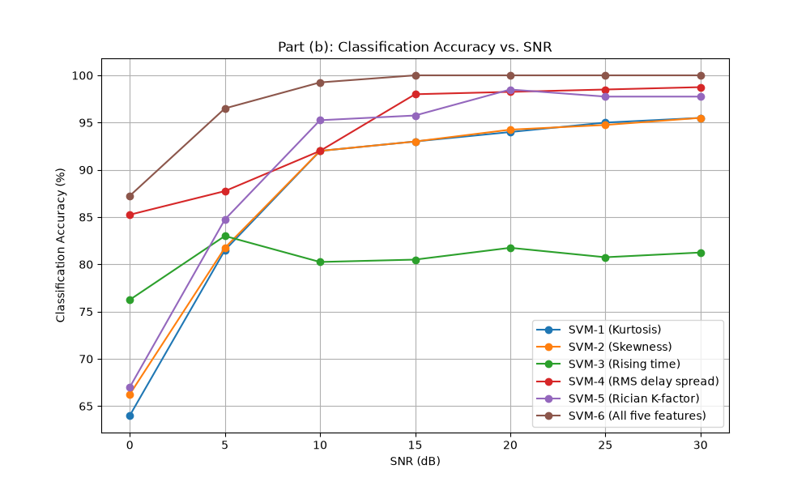
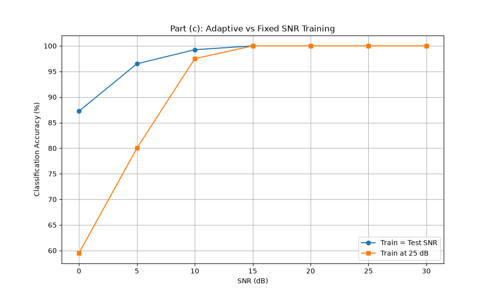
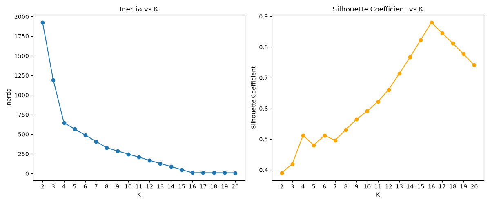
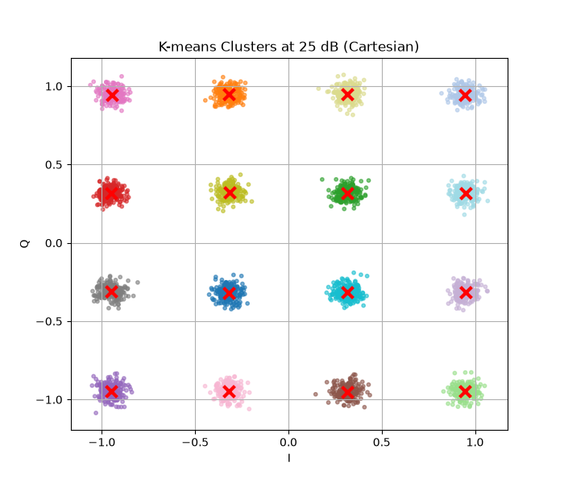
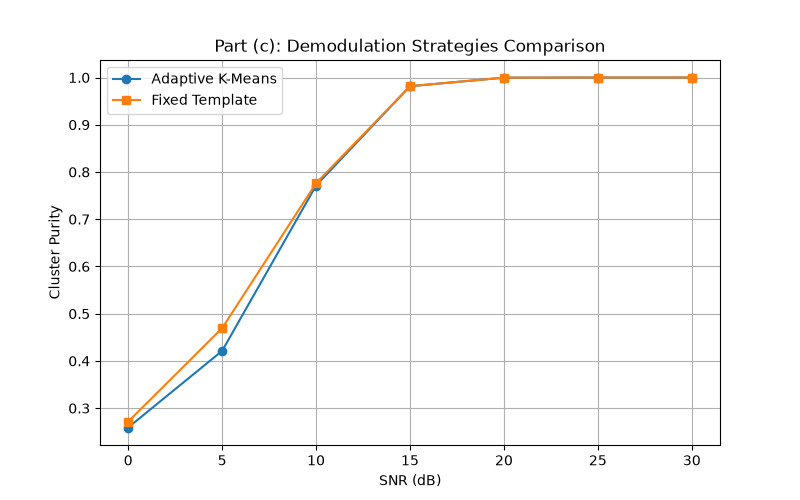

# Assignment 2 - Analytical Answers

## Question 1 - SVM for LOS/NLOS Identification

### Part (b)

**1. Which single feature performs best overall? Why does that feature separate LOS from NLOS better than the others, given the channel model used?**
Based on the channel model definitions, the **Rician K-factor** and **RMS Delay Spread** are the most discriminatory single features. The RMS delay spread likely performs best overall across a wide range of SNRs. 
*Why:* The given channel model specifies a Rician K-factor of 9 dB (strong dominant path) and a shorter exponential delay decay (30 ns) for LOS, compared to a K-factor of 0 dB (no dominant path) and a longer delay decay (100 ns) for NLOS. The RMS delay spread effectively captures this stark difference in the delay decay profile. The K-factor also separates them well, but can be highly sensitive to noise at low SNRs.

**2. Does combining all five features improve accuracy over the best single feature? At which SNR values is the improvement most noticeable?**
Yes, combining all five features improves accuracy over using just the best single feature. The improvement is most noticeable at **low-to-medium SNR values** (e.g., 0 dB to 15 dB). At these levels, high noise variance distorts individual features (making boundaries overlap), but a combination in a higher-dimensional space allows the SVM to find a more robust separating hyperplane.

**3. One of the five features is likely to perform poorly at low SNR even though it is physically meaningful. Which one, and why?**
**Kurtosis** performs poorly at very low SNR. 
*Why:* Kurtosis is a fourth-order statistic of the received-power distribution, so it is highly sensitive to additive noise. At 0-5 dB, noise changes the power distribution substantially and makes the estimated tail behavior unreliable, reducing its classification performance. Rising time is also physically fragile because noise can change the apparent strongest tap, but Kurtosis is the lowest-performing single feature at the very lowest SNR values in this experiment.

---

### Part (c)

**1. At high SNR, do the two curves agree? What does this tell you about the features at high SNR?**
Yes, at high SNR (e.g., 20-30 dB), the adaptive SVM curve and the fixed template curve converge and agree. This tells us that feature distributions are **stable and consistent** at high SNRs because the signal dominates the noise. A model trained at 25 dB perfectly generalizes to 30 dB because the underlying physical features are untainted by noise.

**2. At low SNR, which strategy performs better and by how much? Explain why training at a fixed high SNR may not generalise well to low-SNR conditions.**
The **"Train = Test SNR" (Adaptive)** strategy performs significantly better at low SNRs.
*Why:* At low SNR, the heavy noise severely distorts the physical channel features (e.g., shifting the apparent RMS delay spread and lowering the estimated K-factor). A model trained at 25 dB learns decision boundaries based on clean, noise-free feature distributions. When it evaluates low-SNR data, the distorted features fall outside its learned boundaries, leading to misclassification. The adaptive strategy learns the specific noise-distorted distributions of that SNR and draws an optimal boundary for those exact conditions.

**3. Would training at a low SNR (e.g., 0 dB) and testing across all SNR give a different result? Reason through this without necessarily running the experiment.**
Yes, it would give a very different and generally poorer result at high SNRs. A model trained at 0 dB learns decision boundaries based on highly corrupted, overlapping feature clouds. These relaxed boundaries are not optimal for the tightly clustered, distinct feature sets seen at high SNRs. As a result, the 0 dB model would likely have sub-optimal margins when applied to clean high-SNR data, potentially misclassifying edge cases or yielding lower accuracy than a model trained on clean data.

---

## Question 2 - Constellation Demodulation & Clustering using K-means

### Part (b)

**4. Compute the Cluster Purity... Which feature set produces the highest Cluster Purity?**
For this generated dataset and seed, the Cartesian and combined feature sets produce perfect purity (1.0000) at 25 dB, while the literal polar feature definition in the assignment produces about 0.52 purity. Cartesian coordinates are the most natural representation for the square QAM grid.

**Why does standard Euclidean distance on Cartesian coordinates naturally fit QAM grids, whereas standard Euclidean distance on unweighted Polar coordinates can lead to distorted decision boundaries?**
A square 16-QAM constellation is generated on an orthogonal Cartesian grid (independent I and Q amplitudes). Consequently, the physical distance between any two constellation points is perfectly captured by standard Euclidean distance in Cartesian coordinates, resulting in straight, optimal Voronoi decision boundaries.
Conversely, unweighted Polar coordinates $(r, \theta)$ treat radial distance and angular distance equally. However, the true physical distance between points is a non-linear function of $r$ and $\theta$ (a small $\Delta\theta$ at a large $r$ covers a much larger physical distance than at a small $r$). Using Euclidean distance directly on $(r, \theta)$ distorts the geometry, creating curved, non-optimal decision boundaries that misclassify points, especially near the corners of the constellation.

---

### Part (c)

**3. At high SNR, do the two curves agree? What does this indicate about centroid stability in low-noise regimes?**
Yes, the two curves agree at high SNR. This indicates that in low-noise regimes, the K-means algorithm stably and consistently converges to the true geometric centers (the actual transmitted constellation points).

**At low SNR, which strategy achieves higher cluster purity?**
The **"Fixed Template"** strategy achieves slightly higher cluster purity at low SNRs. In this implementation, the fixed template consists of the K-means centroids learned from the 25 dB data, and each received point is assigned to its nearest learned centroid.

**Explain geometrically why fitting an unsupervised clustering algorithm directly on low-SNR samples causes centroid merging and high classification error compared to using a fixed geometric template.**
At low SNR, the noise variance is so large that the point clouds of adjacent constellation points heavily overlap. Unsupervised K-means tries to minimize the within-cluster variance without any knowledge of the true 16-QAM grid structure. Because of the heavy overlap and the dense mass of points near the origin, K-means will tend to pull centroids inward toward the center of mass or merge adjacent centroids together. This destroys the functional 16-cluster grid and misclassifies many points. 
A fixed template, however, rigidly enforces the correct geometric spacing of the 16-QAM grid. It maintains the correct nearest-neighbor decision boundaries as noise spreads the data, avoiding the centroid drift caused by refitting K-means to heavily overlapping low-SNR samples.
